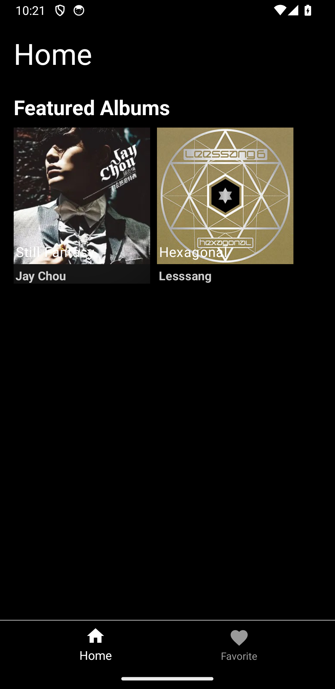
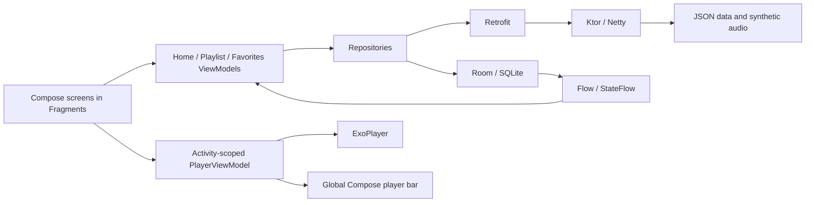

# Full-Stack Android Music Streaming Application

A Kotlin music player with a Jetpack Compose/Fragment interface and a Ktor/Netty backend. Browse albums, save favorites locally, and play HTTP audio through a shared player bar.

This portfolio project demonstrates Android state management, client/server integration, local persistence, and repeatable functional and performance tests.



## Features

- **Album browsing:** Home feed, album artwork loaded with Coil, and playlist detail screens.
- **Local favorites:** Room storage with Flow/StateFlow updates shared between playlist and favorites ViewModels.
- **Audio playback:** ExoPlayer playback, pause, progress updates, and seeking through an activity-level player bar.
- **Navigation:** XML navigation graph, Fragments, Safe Args, and Compose screen content.
- **Backend:** JSON endpoints for albums and playlists, plus static HTTP audio resources.
- **Verification:** Backend contract tests, Android UI interaction tests, database persistence checks, and playback measurements.

## Technology

| Layer | Technologies |
| --- | --- |
| Android | Kotlin, Jetpack Compose, XML/Fragments, Navigation, ViewModel |
| State and dependencies | Coroutines, Flow/StateFlow, Hilt |
| Data | Retrofit/Gson, Room/SQLite |
| Media | ExoPlayer, Coil |
| Backend | Ktor, Netty, kotlinx.serialization |
| Tests | JUnit, Ktor test host, AndroidJUnitRunner, Espresso, Compose UI tests |

## Architecture



## Run locally

### Requirements

- JDK 17.
- Android Studio and an Android SDK installation with API 33 available for compilation.
- An Android emulator. API 34 was used for the recorded measurements; the configured minimum SDK is 23.

The Gradle wrapper pins Gradle 7.5 and the project uses Android Gradle Plugin 7.4.2. `JAVA_HOME` should point to a JDK 17 installation.

### Setup

1. Clone the repository and open it in Android Studio. Let Android Studio configure the SDK location, or create an untracked `local.properties` containing `sdk.dir=/absolute/path/to/Android/sdk`.
2. Start the backend from the project root:

   ```bash
   ./gradlew :backend:run
   ```

3. Run the `app` configuration on an Android emulator. The client reaches the host backend at `http://10.0.2.2:8080/`.

On Windows, use `gradlew.bat` in place of `./gradlew`.

The backend listens on port 8080. To use a physical device, adjust both the client's base URL and the audio URLs in `backend/src/main/resources/playlists.json` to a reachable host address.

### Build and test

```bash
# Original backend contract tests and the Android debug build
./gradlew :backend:test --tests com.laioffer.ApplicationTest :app:assembleDebug

# Real Netty HTTP benchmark on local port 18080
./gradlew :backend:test --tests com.laioffer.ResumeBenchmarkTest --rerun-tasks

# Instrumented Android tests: start the backend and emulator first
./gradlew :app:connectedDebugAndroidTest

# Recalculate and validate the checked-in benchmark evidence
python3 scripts/verify_benchmark_evidence.py
```

The HTTP benchmark needs port 18080 to be free. Run it separately from Android latency measurements to avoid competing workloads. Class names beginning with `Resume` refer to the portfolio measurement suite.

## Recorded measurements

Measured on **September 8, 2026**, using an **Apple M2 Pro / 16 GiB host**, **Android 14 arm64 emulator**, and a **debug build**.

| Area | Observed result | Scope |
| --- | --- | --- |
| Navigation | 80/80 destination checks passed | 20 cycles across Home, Favorites, and Playlist |
| Favorites persistence | 1,000/1,000 records restored per round | 3 rounds; database close/reopen and full-field comparison |
| Favorite state propagation | 17.1 ms P95 across 300 mutations | Until both ViewModel states match; excludes rendering |
| Backend HTTP | 30,000 expected responses; worst round P95 4.2 ms | 20 concurrent threads; local HTTP and small fixtures |
| Playback startup | Approximately 412 ms P95 across 90 starts | Local HTTP, reused player per round, synthetic 3-second audio |
| Paused seeking | 90/90 position checks passed | Functional checks, not decoder seek latency |

These are bounded local measurements, not production capacity claims. Backend rounds lasted roughly 0.7–1.0 seconds. Playback startup measures player state and position advancement, not audible output latency. All measured samples, including slow starts, are retained.

See [benchmark methodology and reproduction steps](docs/BENCHMARKS.md) and [raw measurement data](docs/benchmarks/2026-09-08/).

## Project structure

```text
app/
  src/main/java/com/laioffer/spotify/
    ui/             Home, Favorites, Playlist, and theme
    player/         Player state, controls, and dependency module
    repository/     Network and favorites data access
    database/       Room database and DAO
    network/        Retrofit API and configuration
  src/androidTest/  Navigation, persistence, state, and playback tests
backend/
  src/main/         Ktor application, JSON fixtures, and synthetic audio
  src/test/         API contract tests and the HTTP benchmark
docs/              Screenshot, methodology, and recorded measurements
scripts/           Evidence verification
```

## Demo scope and provenance

The initial application follows a course implementation guide; this repository includes the runnable client/backend integration and the measurement suite. Course source documents and personal resume files are not distributed here. The application is inspired by Spotify and is not affiliated with Spotify.

- The catalog currently contains two demo albums and two synthetic three-second audio files. The filenames follow the course examples; the bundled files are not recordings of the named songs.
- Album artwork is loaded from the external URLs in the fixtures. Artwork and course-supplied visual assets belong to their respective owners.
- The original teaching behavior is retained: Home requests include an intentional three-second delay, and the Hexagonal album is seeded into Favorites at startup.
- The current implementation uses local HTTP, a fixed demo catalog, basic error handling, and activity-level playback. Authentication, a production catalog, download/offline playback, and a foreground media service are outside its current scope.
